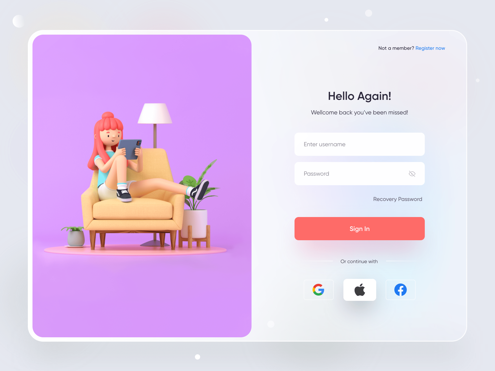

<h1 align="center"></h1>

🔑 Login Page - Web Design <small>[web UI-UX]</small> is an small demo that I've implemented from the design of [Yasir Ahmad Noori](https://dribbble.com/yasirnoori) created. The information of this design will be found [here](https://dribbble.com/shots/15883367-Login-Page-Web-Design).

## Demo
🚀 I deployed this project to Vercel. A live demo is available on [https://login-page-three-gamma.vercel.app/](https://login-page-three-gamma.vercel.app/).

## Features
### 🎉 Validation (User can't leave one of the fields empty)

### 🎉 Responsive (Laptop - Tablet - Mobile)
### 🎉 Notification (When user press Sign In buttton)
### 🎉 Animation (Simple bubble animation in background)

## Getting Started

```bash
npm install
```
Run the development server
```bash
npm run dev
```
Development server will run on: http://localhost:5173/

Run the production mode:

```bash
npm run build && npm run preview
```
Production server will run on: http://localhost:4173/
## Technology

- ⚡️ [Vite](https://vitejs.dev/)
- ⚛️ [React](https://reactjs.org/)
- 🎨 [Sass](https://sass-lang.com/)
- 👮 [Typescript](https://www.typescriptlang.org/)
- 🎯 [Formik](https://formik.org/)
- 🚧 [Yup](https://github.com/jquense/yup)
- ⭐️ [React Icons](https://react-icons.github.io/react-icons/)
- 🔔 [React-Toastify](https://www.npmjs.com/package/react-toastify)
- 🪄 [Tippy.js for React](https://github.com/atomiks/tippyjs-react)


